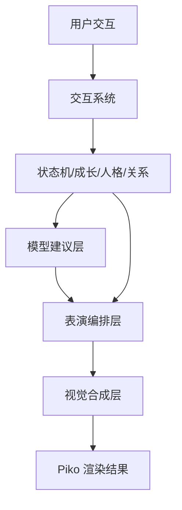

# Piko 角色驱动化视觉系统设计

## 1. 问题定义

当前 Piko 的表现主要依赖用户指定照片作为视觉底图，动作也更多是在既有照片内容上做有限切换。这种方式能快速出效果，但长期看会有几个明显问题：

- 角色感不稳定，容易更像“会动的图片”。
- 动作表达空间有限，很多情绪只能靠换图，而不是靠表演。
- 交互与视觉是割裂的，用户行为没法真正改变角色的“活法”。
- 记忆、成长、关系阶段难以在视觉上自然显现。

本方案目标是把 Piko 从“照片驱动”升级为“角色驱动”。

## 2. 目标

1. 让 Piko 成为一个持续存在的角色，而不是素材播放器。
2. 保留照片作为来源素材，但不再让单张照片决定全部表现。
3. 让表情、动作、语气、节奏、记忆和关系阶段共同决定角色表现。
4. 让大模型参与“表演导演”，但不让模型直接接管执行层。

## 3. 设计原则

1. 照片是起点，不是终点。
2. 角色表现优先于素材切换。
3. 小动作和微表情比大幅换图更重要。
4. 模型负责建议，本地负责约束与执行。
5. 所有视觉变化必须能回到角色状态和交互语义上解释。

## 4. 总体架构



推荐将 Piko 拆成四层：

| 层级 | 职责 |
| --- | --- |
| 身份层 | 名字、性格、偏好、关系阶段、长期习惯 |
| 表演层 | 说话方式、动作节奏、表情风格、安静程度 |
| 视觉层 | 底图、表情、局部位移、微动作、光效 |
| 记忆层 | 近期互动、关系成长、主动行为偏好、历史偏好 |

## 5. 视觉表达策略

### 5.1 照片的定位

照片保留，但只承担两种角色：

- 起源参考：用于建立“像谁”的基础感。
- 纪念素材：用于特殊时刻、回忆卡片、阶段纪念。

运行时不直接把照片当成最终展示结果，而是把它当作角色底层纹理或参考图。

### 5.2 分层角色渲染

建议将角色视觉拆成可叠加图层：

- 底图层：角色主体轮廓、服饰、基础姿态。
- 表情层：眼睛、眉毛、嘴、脸部高光。
- 动作层：头部微倾、身体前后轻摆、轻跳、收缩、转向。
- 状态层：困倦、开心、思考、专注、庆祝、休息。
- 环境层：呼吸光、注意力提示、微粒子、阴影/高光变化。

这样能避免“整张图切换”的机械感。

### 5.3 动作语汇

动作不要无限扩张，优先形成一套稳定的小语汇：

- 望向鼠标
- 轻轻点头
- 左右晃动
- 微微后退
- 开心靠近
- 安静停住
- 困倦缩起
- 专注凝神
- 轻微跳动
- 轻轻蹭一下

动作的价值不在复杂，而在可被一致地重复和组合。

## 6. 表演编排层

表演编排层的工作是把“当前角色状态”翻译成“此刻应该怎么演”。

### 输入

- 交互事件
- 关系阶段
- 人格状态
- 互动统计
- 当前模式
- 系统上下文（空闲、工作、提醒、聊天）

### 输出

- 动作候选
- 动作优先级
- 动作节奏
- 表情建议
- 台词建议
- 是否需要主动靠近或保持安静

### 设计要求

- 模型只输出建议，不直接控制渲染。
- 本地系统根据安静模式、频率限制、当前状态做最终裁决。
- 低风险变化优先采用轻量动作，不要频繁切大动作。

## 7. 与现有系统的关系

这套视觉系统应该复用现有能力，而不是推倒重来：

| 现有模块 | 在新方案中的位置 |
| --- | --- |
| `petState` | 主状态机，决定大状态流转 |
| `InteractionManager` | 输入语义化入口 |
| `PersonalityManager` | 实时人格变化来源 |
| `GrowthSnapshot` | 长期成长与阶段信息来源 |
| `DialogueSystem` | 台词和语气来源 |
| `BehaviorSystem` | 主动行为与动作优先级来源 |
| `petAi` | 模型建议层入口 |

也就是说，新的视觉系统不是替代这些模块，而是把它们的结果统一表现出来。

## 8. 角色包设计

建议新增一个角色包概念，类似：

```text
assets/piko/
├── identity/
│   ├── base.json
│   └── lore.json
├── expression/
│   ├── neutral.png
│   ├── happy.png
│   ├── curious.png
│   └── sleepy.png
├── motion/
│   ├── idle.json
│   ├── greet.json
│   ├── playful.json
│   └── focused.json
├── layers/
│   ├── eyes/
│   ├── mouth/
│   ├── outline/
│   └── effects/
└── memory/
    └── stage-history.json
```

### `base.json`

定义角色基础信息：

```json
{
  "name": "Piko",
  "species": "desktop-companion",
  "style": "soft-realistic",
  "defaultMood": "neutral",
  "preferredMotion": "balanced"
}
```

### `motion.json`

定义动作片段和节奏：

```json
{
  "idle": ["breath", "blink", "small-sway"],
  "greet": ["look-up", "nod", "small-wave"],
  "curious": ["tilt-head", "look-side", "blink-fast"]
}
```

## 9. AI 参与方式

模型参与的内容建议分三类：

1. 台词生成
   - 更自然的回应
   - 更贴合关系阶段的短句

2. 节奏建议
   - 更安静
   - 更活跃
   - 更专注

3. 行为优先级
   - 今天更该先出现哪类动作
   - 哪些动作应降低频率
   - 哪些动作更适合当前关系阶段

模型不应直接输出复杂可执行脚本，只输出有限枚举或短建议，方便本地约束。

## 10. 迁移方案

### Phase 1: 照片上叠角色层

- 保留当前照片底图。
- 加入眼睛、嘴巴、头部微倾、呼吸、轻微光效。
- 先让它“会看你、会呼吸、会点头”。

### Phase 2: 引入标准动作集

- idle
- greet
- curious
- sleepy
- playful
- focused
- celebrate

每个动作都应有：

- 姿态
- 表情
- 节奏
- 最小持续时间
- 回退动作

### Phase 3: 角色包化

- 从单张图升级到配置化角色包。
- 把可换资产、动作片段和记忆数据分离。
- 让同一角色可以跨设备、跨版本演化。

### Phase 4: 模型导演化

- 模型输出角色今天的行为偏好。
- 本地系统根据优先级、安静模式和上下文落地。
- 角色表现持续随关系和人格成长而变化。

## 11. 验收标准

1. Piko 不再主要依赖单张照片切换状态。
2. 任意一次交互都能带来微表情或微动作反馈。
3. 同一角色在不同关系阶段下会有明显不同的节奏。
4. 模型建议失效时，本地仍可稳定回退。
5. 角色的长期变化可以被记忆系统解释和追踪。

## 12. 风险与约束

| 风险 | 说明 | 应对 |
| --- | --- | --- |
| 角色僵硬 | 只加层不改节奏 | 把动作和人格/关系绑定 |
| 过度依赖模型 | 结果不稳定 | 模型只给建议，本地裁决 |
| 表现太花 | 干扰用户工作 | 保持默认低打扰 |
| 资源膨胀 | 角色包过大 | 分层加载、按需激活 |

## 13. 建议的下一步

优先顺序建议是：

1. 给现有渲染层加入表情/眼睛/嘴巴的局部层。
2. 把 idle / greet / curious / sleepy 做成统一动作模板。
3. 用关系阶段和人格状态驱动动作选择。
4. 再把模型导演化接入。

这样 Piko 会先“像一个角色”，再慢慢“像一个活着的伙伴”。
