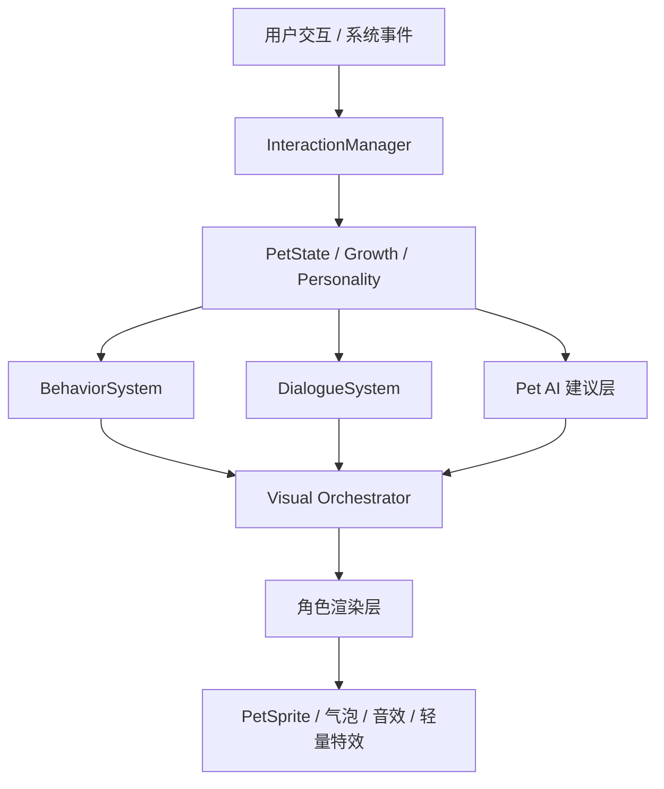

# Piko 角色驱动化视觉技术方案

## 1. 目标

把 Piko 从“照片驱动的桌面宠物”升级成“角色驱动的桌面伙伴”。

当前系统已经具备：

- `PetWindow` 中的状态机、交互、人格、成长与气泡联动
- `PetSprite` 的基础渲染能力
- `BehaviorSystem` 的主动行为编排
- `petAi` 的模型建议层

这份方案的重点不是重写，而是把现有能力收束到一条清晰的角色渲染链路里。

## 2. 技术原则

1. 照片只做起源素材，不做唯一表现源。
2. 角色表现由状态、情绪、关系阶段、人格和行为偏好共同决定。
3. 模型只输出建议，不直接控制渲染执行。
4. 所有视觉变化都要能回溯到语义事件。
5. 低打扰优先，默认仍然适合桌面工作场景。

## 3. 现状基线

当前相关代码已经形成了几条稳定链路：

| 模块 | 现状 |
| --- | --- |
| `src/features/app/appShared.tsx` | `PetSprite` 负责基础视觉切换，当前有 `lumi / custom / classic` 三种视觉风格 |
| `src/features/pet/PetWindow.tsx` | 负责交互、状态、成长、人格、气泡、音效和主动行为编排 |
| `src/features/pet/personality/*` | 负责人格推导、行为系统、对话系统、运行时持久化 |
| `src/features/pet/interaction/*` | 负责交互识别、成长统计、模型建议和文案生成 |
| `src-tauri/src/lib.rs` | 负责模型请求和宠物生成接口 |

本方案将在这些模块上扩展，而不是另起一套渲染架构。

## 4. 总体架构



核心思想是把视觉表现拆成一个独立的“角色编排层”：

- 输入来自交互、状态、人格、成长和模型建议
- 输出是动作、表情、节奏、微反应和视觉层级选择

## 5. 角色分层

建议把 Piko 拆成四层。

### 5.1 身份层

固定角色是谁：

- 名字
- 性格
- 喜好
- 不喜欢什么
- 关系阶段
- 角色口癖或短句风格

这层信息来源于配置与长期记忆，不应由单次交互直接改写。

### 5.2 表演层

决定此刻怎么演：

- 当前状态
- 当前情绪
- 主动行为偏好
- 动作节奏
- 语气强度
- 是否主动靠近

### 5.3 视觉层

决定怎么画出来：

- 底图或角色主体
- 局部表情层
- 局部位移层
- 动作姿态层
- 轻量特效层

### 5.4 记忆层

决定角色为什么会这样演：

- 最近互动次数
- 亲密度变化
- 近期行为偏好
- 用户工作节奏
- 历史成长阶段

## 6. 推荐的数据模型

### 6.1 角色配置

建议新增一个角色配置文件，例如：

```json
{
  "id": "piko",
  "name": "Piko",
  "source": "photo-reference",
  "style": "character-driven",
  "defaultVisualProfile": "balanced",
  "defaultMotionProfile": "balanced",
  "defaultBehaviorProfile": "balanced"
}
```

### 6.2 视觉配置

```ts
export type PikoVisualProfile = "photo" | "character" | "classic";

export interface PikoRenderState {
  mode: PetMode;
  emotion: PetEmotion;
  reaction: PetReaction;
  bondTier: BondTier;
  personality: PersonalityDimensions;
  visualProfile: PikoVisualProfile;
  motionProfile: PetMotionStyle;
  behaviorProfile: PetBehaviorProfile;
}
```

### 6.3 角色动作描述

```ts
export interface PikoMotionFrame {
  pose: "idle" | "greet" | "curious" | "sleepy" | "playful" | "focused" | "celebrate";
  durationMs: number;
  emphasis?: "soft" | "balanced" | "lively";
  layers?: Array<"body" | "eyes" | "mouth" | "head" | "effect">;
}
```

## 7. 渲染实现方案

### 7.1 现有 `PetSprite` 的扩展方式

当前 `PetSprite` 已经根据 `mode / emotion / reaction / visualStyle` 计算视觉效果。
技术上建议在不破坏现有风格的前提下，新增一个 `character` 视觉风格。

建议的视觉风格演进：

- `classic`：历史兜底
- `custom`：用户指定照片
- `lumi`：现有机甲猫风格
- `character`：角色驱动风格

`character` 模式下，渲染优先使用：

1. 角色基础层
2. 表情层
3. 动作层
4. 微特效层

而不是直接替换整张图。

### 7.2 视觉合成策略

建议按照“底图 + 局部层 + 轻量状态特效”的方式实现：

- 底图：角色主体轮廓
- 眼睛层：视线跟随、眨眼、惊讶、困倦
- 嘴巴层：微笑、专注、困倦、庆祝
- 头部层：轻微偏头、点头、后仰
- 身体层：轻摆、呼吸、后退、靠近
- 特效层：注意力脉冲、轻光、庆祝闪烁

这类视觉变化比整图切换更像“活着的角色”。

### 7.3 技术选型建议

按复杂度从低到高：

1. CSS + 分层图片
2. Canvas 合成
3. PixiJS 分层精灵
4. Spine / Live2D / 等效骨骼方案

当前阶段建议先走：

- 低成本层：CSS + 分层资源
- 中期层：Canvas 或 PixiJS
- 高阶层：骨骼或半骨骼表达

这样可以先把角色活性做出来，再逐步提升表现质量。

## 8. 行为驱动渲染

### 8.1 输入源

角色渲染层的输入应该来自四类：

- `PetState`
- `PersonalityManager`
- `BehaviorSystem`
- 模型建议层 `petAi`

### 8.2 输出内容

角色渲染层应输出：

- 主姿态
- 微表情
- 动作节奏
- 眼神方向
- 主动靠近/远离
- 是否显示短暂特效

### 8.3 编排顺序

建议优先级如下：

1. 系统状态约束
   - `error`、`resting`、`working` 等优先级最高
2. 交互语义
   - 点击、抚摸、拖放、返回、提醒
3. 关系阶段
   - `new / warm / trusted / close`
4. 人格状态
   - `energy / humor / curiosity`
5. 模型建议
   - 行为偏好、动作风格、台词语气

这样可以避免模型建议把基础状态顶掉。

## 9. 模型参与方式

模型应分三类任务：

### 9.1 台词生成

已有链路继续沿用。

### 9.2 节奏建议

继续输出闲置节奏建议，例如：

- `soft`
- `balanced`
- `lively`

### 9.3 行为优先级

建议扩展为有序标签数组，例如：

- `calm`
- `balanced`
- `playful`
- `curious`
- `focused`

前端和行为系统据此决定今天更先出现哪一类动作。

> 模型输出永远是建议，不是最终执行指令。

## 10. 模块改造建议

### 10.1 `src/features/app/appShared.tsx`

建议扩展 `PetVisualStyle`：

```ts
export type PetVisualStyle = "lumi" | "custom" | "classic" | "character";
```

然后让 `PetSprite` 识别 `character`，并渲染分层角色组件。

### 10.2 `src/features/pet/PetWindow.tsx`

职责保持不变，但增加：

- 角色视觉配置加载
- 角色渲染状态拼装
- 模型建议结果注入
- 视觉状态更新节流

### 10.3 新增视觉模块

建议新增目录：

```text
src/features/pet/visual/
├── characterTypes.ts
├── characterConfig.ts
├── CharacterRenderer.tsx
├── characterMotion.ts
├── characterExpression.ts
├── characterOrchestrator.ts
└── character.test.ts
```

模块职责：

| 文件 | 作用 |
| --- | --- |
| `characterTypes.ts` | 定义角色状态、动作、表情、视觉档位 |
| `characterConfig.ts` | 角色配置和默认资源映射 |
| `CharacterRenderer.tsx` | 角色分层渲染组件 |
| `characterMotion.ts` | 把状态映射到动作帧 |
| `characterExpression.ts` | 把情绪映射到表情层 |
| `characterOrchestrator.ts` | 汇总状态、模型建议和视觉层输出 |
| `character.test.ts` | 覆盖动作选择、状态优先级和回退策略 |

## 11. 迁移路径

### Phase 1: 视觉层抽象

- 不移除照片模式。
- 新增 `character` 风格入口。
- 先做一个最小角色层，把眼睛、嘴和轻微位移做出来。

### Phase 2: 动作模板化

- 把 `idle / greet / curious / sleepy / playful / focused / celebrate` 做成标准动作模板。
- 每个动作只保留少量稳定变化。

### Phase 3: 角色配置化

- 把资源映射、默认表情、动作节奏、模型建议缓存配置化。
- 让 Piko 角色状态可持久化、可升级。

### Phase 4: 模型导演化

- 让模型输出“今天更适合什么表演风格”。
- 前端基于模型建议和本地约束完成最终渲染编排。

## 12. 验收标准

1. Piko 不再主要依赖单张照片的切图切换。
2. 用户交互时，Piko 至少会产生微表情或微动作反馈。
3. 同一状态下，关系阶段不同，视觉节奏不同。
4. 低打扰模式下，视觉表现仍然克制。
5. 模型失效时，本地可稳定回退到规则和默认表演。

## 13. 风险与约束

| 风险 | 说明 | 应对 |
| --- | --- | --- |
| 角色化不够 | 仍像素材播放器 | 强制加入表情和节奏层 |
| 资源爆炸 | 图层过多 | 先最小分层，逐步扩展 |
| 模型波动 | 建议不稳定 | 本地兜底、缓存和节流 |
| 性能压力 | 分层渲染更重 | 限制刷新频率，合并状态更新 |

## 14. 最终建议

最稳妥的路径不是马上彻底替换照片，而是：

1. 先加 `character` 角色层。
2. 让 Piko 在相同照片基础上拥有“眼神、呼吸、节奏、动作”。
3. 再逐步减少照片在最终视觉中的权重。

这样能平滑地把 Piko 从“会动的图片”变成“会表演的角色”。
