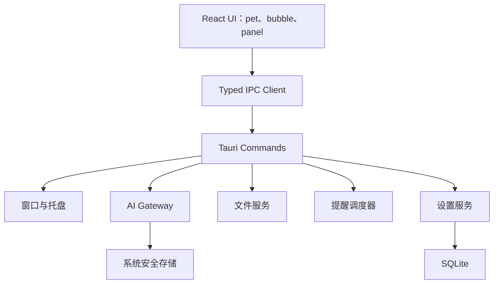

# 跨平台桌面 AI 宠物精灵助手产品实施基线

> 文档版本：`v0.2`  
> 目标平台：macOS、Windows、Linux  
> 推荐技术栈：Tauri 2、React、TypeScript、Rust

## 1. 产品设计

产品是一只常驻桌面的 AI 宠物精灵：平时低干扰陪伴，需要时快速响应，并在用户明确授权后完成有限、可预览、可撤销的任务。

### 设计原则

1. 先是伙伴，再是工具。
2. 默认安静，不打断专注、会议和演示。
3. 高风险操作遵循“先预览、再确认、可撤销”。
4. 权限按需申请，说明用途和数据流向。
5. 核心体验跨平台一致，平台差异诚实呈现。

### P0 MVP

| 模块 | 能力 |
| --- | --- |
| 桌面精灵 | 透明置顶、拖动、隐藏、恢复、基础动画 |
| 快速对话 | 文本问答、流式响应、停止生成、复制结果 |
| 文件交互 | 拖入单个文本文件，进行总结、翻译、解释 |
| 截图提问 | 用户主动截图，预览后发送 |
| 提醒 | 创建一次性提醒、查看列表、到点通知 |
| 权限中心 | 查看通知、截图、文件访问状态 |
| 个性化 | 精灵命名、主题色、活泼度、开机启动 |
| 系统集成 | 托盘菜单、全局快捷键、检查更新入口 |
| 隐私 | 清除历史、暂停感知、日志脱敏 |

### 暂不纳入

- 持续读取屏幕、摄像头或麦克风
- 未经确认删除、移动、覆盖文件
- 未经确认发送邮件、消息或发布内容
- 支付、下单和账户变更
- 让模型执行任意 Shell 命令

### 窗口结构

| 窗口 | 用途 | 默认尺寸 | 行为 |
| --- | --- | ---: | --- |
| `pet` | 桌面精灵本体 | `156 x 156` | 透明、无边框、置顶 |
| `bubble` | 快速对话和确认卡 | `360 x 214` | 按需显示、置顶 |
| `panel` | 历史、提醒、权限和设置 | `400 x 700` | 普通管理窗口 |
| `capture` | 截图选择蒙层 | 全屏 | 区域框选、预览确认后发送 |

### 精灵状态机

```text
error > confirming > working > speaking > thinking > listening > resting > idle
```

| 状态 | 表现 |
| --- | --- |
| `idle` | 呼吸、眨眼、轻微漂浮 |
| `listening` | 靠近用户，触角亮起 |
| `thinking` | 核心光点旋转 |
| `speaking` | 核心有节奏闪烁 |
| `working` | 展开能量环 |
| `success` | 简短跃动 |
| `confirming` | 举起确认卡 |
| `resting` | 趴下并降低动画频率 |
| `error` | 短暂疑惑，展示恢复建议 |

### 核心交互

| 操作 | 行为 |
| --- | --- |
| 单击精灵 | 展开迷你气泡 |
| 拖动精灵 | 自由移动位置，停止拖动后自动保存 |
| 拖入文件 | 后续弹出总结、翻译、解释选项 |
| 全局快捷键 | `CommandOrControl+Shift+Space` 打开气泡 |
| 点击托盘图标 | 恢复精灵 |

### 权限与隐私

API Key 必须保存到操作系统安全存储，不能进入 SQLite、前端状态或日志。日志不记录完整对话、文件正文和真实文件路径。

## 2. 技术设计

采用 **Tauri 2 + React + TypeScript + Rust**：

- Tauri 使用系统 WebView，适合控制安装包与后台资源占用。
- Rust 层统一处理窗口、文件、数据库、安全存储和 AI 请求。
- React 层负责精灵状态、气泡和面板交互。
- 原生能力必须通过有限、类型化的 IPC commands 暴露。

### 总体架构



### IPC 边界

MVP 只允许白名单操作：

```text
show_bubble
hide_bubble
open_panel
show_pet
prepare_text_attachment
chat_start
chat_cancel
create_reminder
clear_chat_history
```

不能向模型暴露任意 Shell 执行能力。

### 平台差异

| 能力 | macOS | Windows | Linux |
| --- | --- | --- | --- |
| 透明置顶窗口 | 支持，验证鼠标穿透 | 支持，验证缩放 | 受 Wayland/X11 差异影响 |
| 截图权限 | 需要屏幕录制授权 | 通常无需单独授权 | 依赖桌面环境 |
| 桌面自动化 E2E | 无 Tauri WebDriver 客户端 | 支持 | 支持 |

Linux 首批建议支持 Ubuntu LTS + GNOME。

## 3. 实施计划

| 阶段 | 周期 | 目标 |
| --- | --- | --- |
| M0 | 第 1 周 | 三窗口 Spike、托盘、快捷键、跨平台验证 |
| M1 | 第 2 周 | 精灵状态机、位置恢复、基础设置 |
| M2 | 第 3 周 | AI 文本对话、流式响应、安全存储 |
| M3 | 第 4 周 | 文本文件拖入、截图提问 |
| M4 | 第 5 周 | 提醒、通知、权限中心 |
| M5 | 第 6 周 | 正式动画、性能优化、静默规则 |
| M6 | 第 7 周 | 自动化测试、CI、安装包 |
| M7 | 第 8 周 | Beta 冒烟、缺陷修复、发布 |

M0 至 M4 已完成，P1 体验打磨也已完成。当前已实现桌面骨架、精灵状态、多提供商流式聊天、会话级最近十轮上下文、文本附件、截图提问、周期提醒、权限中心、基础个性化、Markdown 优化、面板 Tab 导航和本地 TTS；P2 已完成空闲检测、多提供商适配、专注模式和受控文件写入。工程化阶段已接入 CI、Web 预览 E2E 和桌面冒烟清单。

后续待实现能力以 [`roadmap.md`](roadmap.md) 为准，包括前台应用感知、工具调用，以及 P3 的生态与分发能力。

## 4. 代码实现

### 当前桌面骨架

```text
pet window
  ├── 点击打开 bubble
  ├── 拖动移动精灵
  └── 打开 panel

tray
  ├── 显示精灵
  ├── 打开助手
  └── 退出

global shortcut
  └── CommandOrControl+Shift+Space 打开 bubble

local settings
  ├── pet-position.json 保存精灵坐标
  ├── app-settings.json 保存应用设置
  ├── chat-history.json 保存最近对话
  ├── reminders.json 保存提醒
  └── focus-records.json 保存专注记录
```

桌面原型仍主要集中在 `src/App.tsx` 和 `src-tauri/src/lib.rs`。后续功能扩展前，应逐步拆分至 `src/features/`、`src/ipc/` 和 `src-tauri/src/services/`。

## 5. 自动化测试流程

### Pull Request

```text
npm ci
npm run build
cargo fmt --check
cargo clippy --all-targets --all-features -- -D warnings
cargo test
```

### 测试金字塔

| 层级 | 工具 | 范围 |
| --- | --- | --- |
| 静态检查 | TypeScript、Clippy | 类型、格式、Rust 警告 |
| 单元测试 | Vitest、cargo test | 状态机、文件校验、提醒恢复 |
| 组件测试 | Vitest Browser Mode | 气泡、确认卡、权限中心 |
| Web UI E2E | Playwright | 不依赖桌面壳层的主流程 |
| 桌面 E2E | tauri-driver | Windows、Linux 桌面能力 |
| 人工冒烟 | 测试清单 | macOS 和平台差异 |

### 桌面冒烟

- 安装、启动、退出、重启
- 精灵透明、置顶、拖动
- 气泡打开、关闭
- 托盘隐藏和恢复精灵
- 全局快捷键打开气泡
- 多显示器和系统缩放

## 6. 官方参考

- [Tauri 2 窗口自定义](https://v2.tauri.app/zh-cn/learn/window-customization/)
- [Tauri 2 系统托盘](https://v2.tauri.app/zh-cn/learn/system-tray/)
- [Tauri 2 全局快捷键](https://v2.tauri.app/plugin/global-shortcut/)
- [Tauri 2 测试说明](https://v2.tauri.app/develop/tests/)
- [Tauri 2 WebDriver](https://v2.tauri.app/develop/tests/webdriver/)
