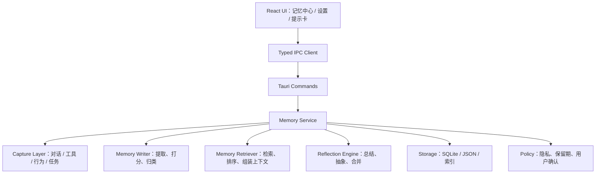

# Piko 持久记忆与成长系统设计文档

> 文档版本：`v1.0`
> 适用范围：桌面精灵的长期记忆、个性化学习、反思成长、记忆管理
> 当前基线：对话、提醒、日程、专注模式、文件写入、截图提问、工具调用、基础插件运行时已完成

## 1. 背景

Piko 当前已经可以完成短期对话、工具调用和若干本地任务，但它的“记住你”能力仍然主要依赖会话上下文窗口。  
这会带来三个问题：

1. 会话一长就装不下。
2. 重启后很多信息就丢了。
3. 即使能记住，也只是“保存历史”，不是“学会用户习惯”。

因此，下一步需要把“记忆”从单纯的聊天上下文，升级为一个长期可积累、可检索、可总结、可删除、可解释的系统。

## 2. 设计目标

### 2.1 产品目标

- 记住用户明确说过的重要事实。
- 记住长期稳定偏好，例如称呼方式、回复风格、工作时间、常用模型。
- 记住任务结果和历史经验，让后续执行更顺。
- 随使用频率增加，Piko 的回复更贴近用户习惯。
- 用户能知道 Piko 记住了什么，也能随时删掉。

### 2.2 技术目标

- 不把所有原始聊天长期塞进上下文。
- 通过分层记忆 + 检索增强实现长期回忆。
- 通过反思总结把事件记忆抽象成语义记忆。
- 通过反馈和置信度机制避免“越学越乱”。
- 默认本地优先，尽量不把长期记忆外传。

### 2.3 安全目标

- 记忆系统不得存储 API Key、密码、一次性验证码等敏感凭据。
- 用户可查看、编辑、删除长期记忆。
- 敏感内容默认不进入长期记忆，或进入后需显式确认。
- 所有记忆用途都要对用户可解释。

## 3. 非目标

以下内容不纳入本阶段：

- 端到端云端个人画像平台
- 训练基础模型参数的持续在线微调
- 持续上传完整聊天原文用于远端训练
- 无用户可见界面的黑箱个性化

本设计关注的是**产品可控的长期记忆系统**，不是把 Piko 变成不可解释的黑盒。

## 4. 总体架构

### 4.1 分层结构



### 4.2 核心原则

1. **不是把历史无限塞进去，而是把历史变成结构化记忆。**
2. **不是每次都记，而是按规则、有选择地记。**
3. **不是只存事实，而是存事实、偏好、模式和反思。**
4. **不是越存越乱，而是要能合并、降权、过期和删除。**
5. **不是隐藏在模型里，而是让用户可见、可控。**

## 5. 记忆分层模型

### 5.1 记忆类型

建议至少分成 5 类：

#### A. 用户档案记忆
长期稳定、用户明确或高度稳定的个人偏好。

示例：
- 用户希望被称呼为什么。
- 用户更偏好中文还是英文。
- 用户喜欢简洁还是详细。
- 用户常用时区、工作时间、常用设备。

#### B. 事件记忆
某一次具体发生过的事实、任务、决定或结果。

示例：
- “2026-06-02 用户要求整理 PR 说明。”
- “用户上次导出日程时选择了 ics 格式。”
- “某次提醒被用户删除，因为时间不合适。”

#### C. 语义记忆
从多个事件中抽象出的稳定规律。

示例：
- “用户偏好先给结论再展开。”
- “用户常在晚上处理整理类任务。”
- “用户对频繁打扰比较敏感。”

#### D. 操作记忆
与任务执行方式有关的经验。

示例：
- 哪种工具调用路径更容易成功。
- 哪类提问应该先查日程再回答。
- 哪些场景下应该先给确认卡。

#### E. 反思记忆
系统自己对最近交互模式的总结。

示例：
- “最近一周用户更常问文档整理和日程规划。”
- “最近多次回答后，用户更偏好列表式输出。”

### 5.2 记忆层级关系

```text
原始事件
  -> 事件记忆
  -> 语义归纳
  -> 稳定偏好 / 操作模式
```

不是所有事件都能升格。只有被重复验证、或足够重要的内容，才会进入更高层。

## 6. 数据模型设计

### 6.1 MemoryItem

建议每条记忆至少包含：

```rust
struct MemoryItem {
    id: String,
    memory_type: MemoryType,
    title: String,
    content: String,
    source: MemorySource,
    importance: u8,
    confidence: f32,
    recency_score: f32,
    privacy_level: PrivacyLevel,
    status: MemoryStatus,
    created_at: u64,
    updated_at: u64,
    last_used_at: Option<u64>,
    expires_at: Option<u64>,
    tags: Vec<String>,
    embedding_id: Option<String>,
}
```

### 6.2 枚举建议

```rust
enum MemoryType {
    Profile,
    Event,
    Semantic,
    Operational,
    Reflection,
}

enum MemorySource {
    UserExplicit,
    Conversation,
    ToolResult,
    TaskOutcome,
    SystemReflection,
}

enum PrivacyLevel {
    PublicToUser,
    SensitiveLocalOnly,
    Ephemeral,
}

enum MemoryStatus {
    Active,
    Archived,
    Superseded,
    Deleted,
}
```

### 6.3 记忆关系

建议支持简单关系，不要一开始就做过重图数据库：

- `duplicates_of`
- `derived_from`
- `conflicts_with`
- `supersedes`
- `related_to`

这样后面就能处理合并、冲突和继承。

## 7. 存储设计

### 7.1 推荐存储组合

建议采用 **SQLite + 轻量索引文件**：

- SQLite：主记忆库、可查询、可版本化。
- 轻量索引：用于快速热数据和最近记忆。
- 可选向量索引：用于语义检索。

### 7.2 为什么不用纯 JSON

纯 JSON 适合当前设置和小规模记录，但不适合长期记忆，因为：

- 查询性能差。
- 去重困难。
- 结构演化不稳。
- 记忆关系难维护。

### 7.3 建议表结构

#### `memory_items`

```sql
id TEXT PRIMARY KEY,
memory_type TEXT NOT NULL,
title TEXT NOT NULL,
content TEXT NOT NULL,
source TEXT NOT NULL,
importance INTEGER NOT NULL,
confidence REAL NOT NULL,
recency_score REAL NOT NULL,
privacy_level TEXT NOT NULL,
status TEXT NOT NULL,
created_at INTEGER NOT NULL,
updated_at INTEGER NOT NULL,
last_used_at INTEGER,
expires_at INTEGER,
embedding_id TEXT
```

#### `memory_tags`

```sql
memory_id TEXT NOT NULL,
tag TEXT NOT NULL
```

#### `memory_relations`

```sql
from_id TEXT NOT NULL,
to_id TEXT NOT NULL,
relation_type TEXT NOT NULL
```

#### `memory_feedback`

```sql
id TEXT PRIMARY KEY,
memory_id TEXT NOT NULL,
feedback_type TEXT NOT NULL,
value INTEGER NOT NULL,
comment TEXT,
created_at INTEGER NOT NULL
```

#### `memory_summaries`

保存周总结、月总结和反思结果。

### 7.4 版本策略

所有记忆相关表都要带 schema 版本，至少支持：

- `schema_version`
- `migrated_at`
- `migration_note`

## 8. 记忆写入策略

### 8.1 写入原则

不是所有对话都值得长期记忆。建议只在以下情况写入：

1. 用户明确说“记住这个”。
2. 内容是稳定偏好。
3. 内容是长期有效事实。
4. 内容会影响后续任务执行。
5. 某个模式重复出现多次。

### 8.2 不写入或降级写入的情况

- 临时情绪发泄
- 明显一次性的事务信息
- 敏感凭据
- 不确定、模糊或互相冲突的内容
- 与任务无关的闲聊噪声

### 8.3 写入流程

```text
输入来源
  -> 候选提取
  -> 规则过滤
  -> 分类分层
  -> 置信度计算
  -> 冲突检查
  -> 存储
  -> 可选用户确认
```

### 8.4 候选提取来源

- 用户显式表达
- 工具调用结果
- 任务完成结果
- 对话中的稳定偏好
- 系统反思结果

### 8.5 置信度计算建议

综合考虑：
- 是否用户明确确认
- 是否重复出现
- 来源是否可靠
- 是否与已有记忆一致
- 最近是否仍然有效

可用一个简单分值：

```text
confidence = explicit_factor + repetition_factor + source_factor + recency_factor - conflict_penalty
```

## 9. 检索与上下文组装

### 9.1 目标

让模型在回答前看到“最相关、最稳、最有用”的记忆，而不是一堆原始历史。

### 9.2 检索输入

检索可参考以下信息：

- 当前用户问题
- 当前会话主题
- 最近任务状态
- 用户最近行为
- 当前窗口类型
- 当前时间和时区

### 9.3 检索输出

输出应该是结构化的上下文块，而不是原始大段历史：

```text
用户偏好：
- 喜欢简洁、结构化回答
- 经常先要结论再展开

相关事件：
- 上次导出日程时选择了 iCalendar
- 最近一次在 PR 说明里要求更详细的变更摘要

当前任务状态：
- 正在整理架构设计文档
```

### 9.4 排序优先级

推荐优先级：

1. 显式用户偏好
2. 当前任务相关事件
3. 最近发生的稳定事实
4. 高置信度语义记忆
5. 反思总结

### 9.5 上下文预算

记忆不能无限塞进提示词。建议按预算分配：

- 当前会话上下文
- 记忆上下文
- 任务/工具上下文
- 反思摘要

超过预算时：
- 先压缩低价值内容
- 再保留高置信度内容
- 最后只留摘要

## 10. 反思与成长机制

### 10.1 反思的目的

“越用越聪明”主要不是学习模型参数，而是持续优化：

- 记得什么
- 怎么记
- 怎么找回
- 怎么总结
- 怎么少打扰

### 10.2 反思节奏

建议三种频率：

1. **实时反思**
   - 某条任务刚完成时
   - 例如提取本次任务结果和偏好信号

2. **日反思**
   - 汇总今天的高价值交互
   - 归纳今天新的偏好和任务模式

3. **周反思**
   - 抽象更高层语义
   - 清理冗余记忆
   - 合并相似记忆

### 10.3 反思输出

反思结果应该是：

- 新的稳定偏好
- 待确认的推断
- 记忆合并建议
- 过期记忆清单
- 任务模式总结

### 10.4 反思不要做什么

- 不要把低置信度猜测写成事实。
- 不要无限生成摘要。
- 不要在用户不知情时扩散敏感内容。
- 不要让反思改变高风险行为默认策略。

## 11. 反馈学习机制

### 11.1 为什么需要反馈

单靠模型自己总结，会有偏差。用户反馈是最直接的校正信号。

### 11.2 可收集的反馈信号

- 用户是否继续追问
- 用户是否直接采用
- 用户是否修正
- 用户是否手动删除记忆
- 用户是否标记某条记忆不准确
- 用户是否点赞某种回复风格

### 11.3 反馈用途

- 调整记忆权重
- 降低错误记忆的优先级
- 增强稳定偏好
- 优化回复风格
- 优化工具路由

### 11.4 反馈界面

建议在记忆中心提供：

- 这条记忆有用 / 没用
- 这条记忆正确 / 错误
- 这条记忆长期有效 / 临时有效
- 删除 / 合并 / 固定 / 降权

## 12. 用户可控性设计

### 12.1 记忆中心

建议在面板中增加“记忆中心”，至少展示：

- 用户档案
- 最近记忆
- 高价值记忆
- 反思摘要
- 可删除项
- 待确认推断

### 12.2 记忆可见性

用户应该能清楚看到：

- Piko 记住了什么
- 记忆来源是什么
- 为什么会记住
- 什么时候记住的
- 能不能删

### 12.3 用户操作

建议支持：

- 查看
- 编辑
- 固定
- 降权
- 合并
- 删除
- 导出
- 清空全部

### 12.4 记忆解释

当 Piko 使用某条长期记忆时，可以轻量提示：

> “我记得你更喜欢简洁结构化回答，所以我先给你结论。”

这会明显提升“被理解”的体验。

## 13. 隐私与安全边界

### 13.1 严格不存

- API Key
- 密码
- 验证码
- 银行卡号
- 证件号
- 其他高敏感凭据

### 13.2 默认本地

长期记忆默认保存在本地。
如未来需要云同步，必须：

- 明示开启
- 明示范围
- 明示加密方式
- 明示删除能力

### 13.3 敏感记忆处理

遇到可能敏感的信息时：

- 优先不写入长期记忆
- 或只写入脱敏摘要
- 或仅保留到会话结束

### 13.4 用户删除优先级最高

用户删除后：

- 从主表删除
- 从索引删除
- 从摘要引用中移除
- 从后续检索中屏蔽

## 14. 与现有系统的集成

### 14.1 与聊天系统

在生成回复前：

1. 读取当前会话上下文
2. 检索相关记忆
3. 组装上下文包
4. 生成回复
5. 从回复和交互中提取新记忆候选

### 14.2 与工具调用

工具调用完成后可写入：

- 任务结果
- 执行经验
- 用户偏好
- 失败原因

### 14.3 与提醒 / 日程 / 专注

这些模块天然适合成为高价值记忆来源，例如：

- 用户常用提醒时间
- 常见重复日程
- 专注时长偏好
- 会议前静默策略

### 14.4 与前台应用感知

应用感知不应该只影响当前状态，也可以沉淀成模式记忆：

- 用户在 IDE 里通常不想被打扰
- 用户在会议中偏好静默
- 用户在浏览器里更愿意正常互动

但这类记忆建议低优先级、可随时调整。

## 15. 建议的 Rust 服务拆分

### 15.1 `memory`

负责记忆主逻辑：

- 写入
- 检索
- 评分
- 合并
- 删除

### 15.2 `reflection`

负责：

- 日反思
- 周反思
- 摘要生成
- 记忆抽象

### 15.3 `memory_policy`

负责：

- 记忆类型判定
- 敏感过滤
- 保留期策略
- 用户确认策略

### 15.4 `memory_ui`

负责前端记忆中心所需命令和事件。

## 16. 前端设计建议

### 16.1 记忆中心页面

建议在 `panel` 中增加一个“记忆” Tab，内容包括：

- 最近记忆
- 用户档案
- 偏好摘要
- 本周反思
- 记忆搜索
- 待确认推断

### 16.2 记忆卡片

每条记忆建议展示：

- 标题
- 内容摘要
- 类型
- 来源
- 置信度
- 更新时间
- 操作按钮

### 16.3 记忆提示

在回答区可以轻量显示：

- “我记得你更偏好……”
- “这条信息来自你上次明确说明”
- “这条记忆需要你确认”

## 17. 里程碑规划

### 阶段 1：可用记忆

目标：
- 支持用户档案记忆
- 支持事件记忆
- 支持查看和删除

### 阶段 2：会检索的记忆

目标：
- 支持语义检索
- 支持上下文自动组装
- 支持记忆排序

### 阶段 3：会反思的记忆

目标：
- 支持日/周反思
- 支持记忆合并
- 支持偏好归纳

### 阶段 4：会成长的记忆

目标：
- 支持反馈学习
- 支持风格个性化
- 支持任务路由优化

## 18. 测试与验收

### 18.1 单元测试

- 记忆写入规则
- 置信度评分
- 检索排序
- 冲突合并
- 过期策略
- 敏感内容过滤

### 18.2 集成测试

- 用户说“记住这个”后是否进入长期记忆
- 记忆删除后是否不再检索到
- 反思摘要是否可用
- 偏好是否能影响后续回复

### 18.3 人工验证

- 用户是否能看懂 Piko 记住了什么
- 用户是否能手动修正记忆
- 用户是否能感知“越用越懂我”

## 19. 风险清单

| 风险 | 说明 | 缓解方式 |
| --- | --- | --- |
| 记忆污染 | 错把一次性内容写成长期偏好 | 置信度、重复验证、用户确认 |
| 记忆膨胀 | 长期累积导致检索噪声变大 | 过期、合并、降权、归档 |
| 隐私风险 | 错存敏感信息 | 敏感过滤、默认本地、可删除 |
| 错误回忆 | 检索到不合适记忆 | 排序规则、冲突判定、反馈修正 |
| 过度个性化 | 习惯固定后变得不灵活 | 可切换模式、可清除偏好 |

## 20. 推荐结论

如果你要做一个真正“有持久记忆、越用越聪明”的 Piko，我建议不要把重点放在“让模型记住更多字”，而要放在：

1. **分层记忆**
2. **结构化存储**
3. **相关检索**
4. **定期反思**
5. **用户反馈**
6. **可见可控**

这六件事做好，Piko 就会从“会聊天的助手”变成“会成长的伙伴”。

