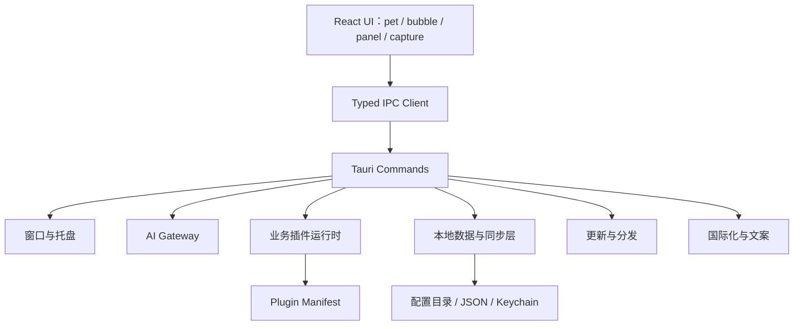

# Piko 下一阶段详细设计文档

> 文档版本：`v1.0`
> 适用范围：P2 剩余能力、P3 生态能力、核心体验优化
> 当前基线：桌面骨架、对话、提醒、本地日程、专注模式、受控文件写入、多提供商适配、基础插件运行时已完成

## 1. 背景

Piko 当前已经具备一套可日常使用的桌面 AI 宠物助手骨架：有 `pet`、`bubble`、`panel`、`capture` 四个窗口，支持多提供商流式对话、提醒、日程、专注模式、截图提问、受控文件写入、权限展示和基础插件体系。

下一阶段的重点不再是“把基础功能做出来”，而是把它推进成一个更完整、更稳、更像产品的桌面伙伴。也就是说，这一阶段的目标是：

1. 让 Piko 更懂场景。
2. 让新用户更容易上手。
3. 让升级、迁移和多语言使用更顺滑。
4. 让插件能力从“可接入”进化到“可扩展”。
5. 让已有能力在跨平台上更稳定、更少打扰。

## 2. 设计目标

### 2.1 产品目标

- 精灵行为更自然，尽量少打断用户。
- 用户第一次打开就知道怎么配、怎么用。
- 后续能力可以在不破坏现有安全边界的前提下扩展。
- 数据可备份、可迁移、可恢复。
- 跨平台差异透明呈现，不靠“假装一致”掩盖现实。

### 2.2 技术目标

- 保持 Tauri 2 + React + TypeScript + Rust 的单体桌面架构。
- 所有高风险能力都通过明确的 IPC 命令、确认卡和权限提示执行。
- 模型永远不能直接获得任意 Shell、文件系统或系统凭据。
- 插件能力以 manifest + 风险等级 + 执行边界为核心。
- 通过分层设计降低 `App.tsx` 和 `lib.rs` 的继续膨胀。

## 3. 范围与非目标

### 3.1 本阶段范围

本阶段覆盖以下能力：

1. 前台应用感知
2. 自动更新
3. 首次启动引导
4. 国际化
5. 通用数据导入/导出
6. 系统日历双向同步
7. 动态 WASM 插件沙箱
8. 代码结构与体验优化

### 3.2 明确非目标

以下内容不纳入本阶段：

- 持续读取屏幕内容
- 摄像头或麦克风访问
- 未经用户确认的文件删除、移动、覆盖
- 未经确认的邮件、消息发送或发布内容
- 支付、下单和账户变更
- 模型执行任意 Shell 命令

这些限制保持和现有安全红线一致。

## 4. 总体架构

### 4.1 系统分层



### 4.2 推荐目录切分

前端建议逐步拆分为：

- `src/features/chat`
- `src/features/pet`
- `src/features/reminders`
- `src/features/calendar`
- `src/features/settings`
- `src/features/onboarding`
- `src/features/i18n`

Rust 侧建议逐步拆分为：

- `src-tauri/src/commands`
- `src-tauri/src/services`
- `src-tauri/src/plugins`
- `src-tauri/src/state`
- `src-tauri/src/sync`

这不是纯整理文件，而是为了让后续功能不会继续堆在一个超大入口里。

## 5. 功能详细设计

### 5.1 前台应用感知

#### 5.1.1 目标

让 Piko 根据用户当前正在使用的应用，自动调整互动强度、情绪表现和打扰策略。

#### 5.1.2 核心规则

- IDE / 编辑器：降低互动频率，偏 `working`
- 浏览器：正常互动
- 视频会议：尽量静默，偏 `resting`
- 游戏：尽量静默，偏 `resting`
- 未识别应用：维持默认策略

#### 5.1.3 数据来源

Rust 侧定期查询前台窗口信息，仅保留应用名或类别，不记录窗口标题正文。

平台实现建议：

- macOS：`NSWorkspace.shared.frontmostApplication`
- Windows：`GetForegroundWindow` + `GetWindowText`
- Linux：优先桌面环境原生 API，必要时回退到 `xdotool`

#### 5.1.4 状态机输入

输入信号：

- 当前活跃应用类型
- 空闲状态
- 专注状态
- 用户是否暂停主动感知

输出结果：

- `pet` 状态
- 情绪提示
- 互动频率

#### 5.1.5 隐私边界

- 不保存窗口标题历史。
- 不记录具体页面内容。
- 不做屏幕内容识别。

#### 5.1.6 验收标准

- 切换到 IDE 时精灵更安静。
- 切换到浏览器时恢复正常。
- 切换到会议场景时不频繁打扰。
- 不产生前台应用历史记录。

---

### 5.2 自动更新

#### 5.2.1 目标

让用户在收到新版本后可以更少操作地升级，降低人工维护成本。

#### 5.2.2 设计原则

- 默认静默检查，不频繁打扰。
- 有更新时提供明确提示。
- 下载与安装失败时有可理解的错误反馈。
- 保留手动打开 Release 页的兜底路径。

#### 5.2.3 更新流程

1. 启动后或定时触发检查版本。
2. 请求 GitHub Releases 元数据。
3. 比较当前版本和最新版本。
4. 若有更新，展示通知或面板提示。
5. 用户确认后下载。
6. 下载完成后提示重启安装。

#### 5.2.4 平台策略

- macOS：下载后走标准更新流程。
- Windows：支持静默升级能力时优先使用静默安装。
- Linux：优先提示包管理器更新，避免复杂的二进制自升级问题。

#### 5.2.5 验收标准

- 能检测到新版本。
- 能正确区分“已是最新”与“有更新”。
- 下载失败有提示。
- 重启后版本生效。

---

### 5.3 首次启动引导

#### 5.3.1 目标

把“第一次打开应用不知道怎么做”的问题，变成一个短、明确、可跳过的引导流程。

#### 5.3.2 引导流程

推荐三步：

1. 给精灵起名字
2. 选择 AI 服务并测试连接
3. 完成并进入桌面

#### 5.3.3 触发条件

- `app-settings.json` 不存在
- 或者存在但没有完成引导标记

#### 5.3.4 持久化

新增一个轻量字段，例如：

- `onboardingCompleted: boolean`
- `onboardingVersion: string`

这样后续升级时可以决定是否再次触发新的引导版本。

#### 5.3.5 验收标准

- 首次启动自动进入引导。
- 可以跳过。
- 完成后不重复弹出。
- 跳过后仍可在面板中重新开启。

---

### 5.4 国际化

#### 5.4.1 目标

把 UI 文案、错误消息、状态提示从“中文硬编码”变成可配置语言包。

#### 5.4.2 支持语言

- `zh-CN`：默认
- `en-US`
- `ja-JP`

#### 5.4.3 设计方式

建议采用轻量语言包方案：

```text
src/locales/
  zh-CN.json
  en-US.json
  ja-JP.json
```

前端通过统一 `t(key)` 读取文案，Rust 错误消息则尽量走标准错误码 + 前端翻译。

#### 5.4.4 语言选择策略

优先级建议：

1. 用户显式选择
2. 系统语言
3. 默认回退到中文

#### 5.4.5 验收标准

- 切换语言后主要 UI 都能变化。
- 新增语言只需补语言文件。
- 系统语言变化后可自动跟随或在下次启动时生效。

---

### 5.5 通用数据导入/导出

#### 5.5.1 目标

解决换设备、备份、恢复和离线迁移的问题。

#### 5.5.2 导出范围

建议支持：

- 对话历史
- 提醒
- 日程
- 个性化设置
- 专注记录

不导出：

- API Key
- 受保护的系统凭据
- 临时附件正文
- 截图原文

#### 5.5.3 文件格式

建议使用 JSON 作为主格式，Markdown 作为对话可读导出格式的补充。

一个导出包可以包含：

```json
{
  "schemaVersion": 1,
  "exportedAt": 1710000000,
  "settings": {},
  "chats": [],
  "reminders": [],
  "calendar": [],
  "focus": []
}
```

#### 5.5.4 导入策略

- 导入前展示预览。
- 导入过程支持合并，不直接无脑覆盖。
- 对重复数据做去重或提示用户选择。
- API Key 只能重新在本机输入，不能被导入包覆盖。

#### 5.5.5 验收标准

- 能导出。
- 能导入。
- 导入后数据恢复正确。
- API Key 不出现在导出包里。

---

### 5.6 系统日历双向同步

#### 5.6.1 目标

让本地日程不仅能“导出给系统看”，还能尽可能与系统日历保持双向一致。

#### 5.6.2 同步分层

建议分成三层：

1. **本地主数据层**：Piko 自己的 `calendar-events.json`
2. **映射层**：本地事件和系统事件 ID 的对应关系
3. **同步适配层**：不同平台日历接口差异

#### 5.6.3 同步模式

推荐从低风险模式开始：

- 初版：单向导出 + 手动导入
- 第二步：本地变更推送到系统日历
- 第三步：拉取系统日历变更回本地
- 第四步：冲突合并和同步标记

#### 5.6.4 冲突策略

冲突来源：

- 时间重叠
- 标题或描述变更
- 同一事件双边修改

优先级建议：

- 用户在 Piko 内的显式修改优先
- 系统日历回流时必须经过映射和冲突判断
- 冲突不自动覆盖，先提示用户

#### 5.6.5 验收标准

- 本地日程能同步到系统日历。
- 系统日历变更能回流到本地。
- 冲突有提示，不静默覆盖。

---

### 5.7 动态 WASM 插件沙箱

#### 5.7.1 目标

让插件不只是“静态声明式只读”，而是可以带动态逻辑，同时不突破现有安全边界。

#### 5.7.2 设计原则

- 插件代码运行在隔离沙箱中。
- 插件不能直接访问任意文件系统或 Shell。
- 所有高风险能力都必须走 Host API。
- 安装前先看 manifest，启用前先确认权限。

#### 5.7.3 插件包结构

建议插件目录包含：

```text
plugins/
  your.plugin.id/
    manifest.json
    main.wasm
    assets/
```

#### 5.7.4 Manifest 扩展

除了名称、版本、工具清单，还需要声明：

- 运行时类型
- 需要的 Host API
- 风险等级
- 确认策略
- 入口模块

#### 5.7.5 Host API 范围

建议先开放：

- 读取 Piko 只读上下文
- 创建确认草稿
- 请求用户确认
- 读取有限的本地配置
- 发起受控网络请求

默认不开放：

- 任意文件读写
- 任意命令执行
- 后台常驻网络连接
- 系统凭据访问

#### 5.7.6 执行模型

1. 加载 manifest。
2. 校验权限。
3. 启动沙箱实例。
4. 通过受限 Host API 与宿主通信。
5. 结果返回给插件运行时，再进入 UI 确认流程。

#### 5.7.7 验收标准

- 插件能在沙箱中执行。
- 插件只能访问被允许的 Host API。
- 高风险操作仍需确认。
- 不引入任意 Shell 或任意文件访问。

---

## 6. 代码优化设计

### 6.1 前端结构优化

当前 `src/App.tsx` 已经承载了太多职责，后续建议按功能切分：

- `PetWindow`
- `BubbleWindow`
- `PanelWindow`
- `OnboardingFlow`
- `I18nProvider`
- `MarkdownContent`
- `FocusCard`
- `CalendarSection`
- `ReminderSection`

目标不是“优雅”，而是降低继续扩展时的认知成本。

### 6.2 Rust 结构优化

当前 `src-tauri/src/lib.rs` 已经承担了太多命令、状态、服务和插件注册逻辑，建议按以下方式拆分：

- `commands`：IPC 命令
- `services`：文件、更新、同步、插件执行
- `state`：共享状态
- `plugins`：内置与外部插件
- `sync`：日历同步与数据导入导出

### 6.3 UI 体验优化

可继续优化的点：

- Markdown 长内容的稳定渲染
- 代码块复制后的反馈提示
- 长列表滚动体验
- 按钮状态与 loading 状态统一
- 错误提示的层级和可恢复性

### 6.4 可观测性

建议继续收敛日志策略：

- 记录操作结果，不记录敏感正文
- 记录错误码，不记录完整请求体
- 需要调试时加可控 debug 开关

## 7. 安全与隐私边界

以下规则在整个下一阶段中都必须维持：

1. API Key 只进系统安全存储。
2. 不持久化附件正文和截图正文。
3. 不保存窗口标题历史。
4. 不允许模型直接执行 Shell。
5. 高风险操作必须预览、确认、可撤销。
6. 插件权限按最小化原则发放。

## 8. 推荐实施顺序

### 第一批

1. 前台应用感知
2. 自动更新

### 第二批

3. 首次启动引导
4. 国际化

### 第三批

5. 通用数据导入/导出
6. 系统日历双向同步

### 第四批

7. 动态 WASM 插件沙箱

这个顺序的好处是先提升“像个产品”的感觉，再补平台能力。

## 9. 验收与测试建议

### 9.1 单元测试

- 前台应用分类规则
- 更新版本比较逻辑
- 导入导出 schema 校验
- 日历同步冲突判断
- 插件 manifest 校验

### 9.2 集成测试

- 引导流程首启判定
- 多语言切换
- 备份与恢复
- 日历导出与导入

### 9.3 人工冒烟

- 托盘恢复
- 更新流程
- 首次启动引导
- 真实系统日历交互
- 真实插件启用和权限确认

## 10. 风险清单

| 风险 | 说明 | 缓解方式 |
| --- | --- | --- |
| 跨平台差异过大 | 日历、前台应用、更新行为在不同系统上差异明显 | 分平台实现，UI 明示能力差异 |
| 插件安全边界变松 | 动态沙箱容易引入能力外溢 | Host API 白名单 + manifest 校验 + 强确认 |
| 文案管理失控 | i18n 改造会波及大量 UI | 先抽取高频文案，逐步迁移 |
| 数据格式演进 | 导入导出和同步可能出现 schema 变化 | 引入 `schemaVersion` |
| 代码继续膨胀 | 继续在单文件里堆功能会恶化维护性 | 先拆前端和 Rust 的职责边界 |

## 11. 建议里程碑

| 里程碑 | 目标 |
| --- | --- |
| M5 | 前台应用感知 + 自动更新 |
| M6 | 首次启动引导 + 国际化 |
| M7 | 数据导入/导出 + 系统日历双向同步 |
| M8 | 动态 WASM 插件沙箱 + 结构拆分收尾 |

## 12. 附录：当前状态参考

当前已完成的能力与验证记录可参考：

- [README.md](../README.md)
- [roadmap.md](roadmap.md)
- [current-validation-report.md](current-validation-report.md)
- [plugin-architecture.md](plugin-architecture.md)
- [tool-use-calendar-design.md](tool-use-calendar-design.md)

